# Automate Email Responses Using Amazon Bedrock Agents and Knowledge Bases


> Amazon Bedrock is a fully managed service that offers a choice of high-performing foundation models (FMs) from leading AI companies like AI21 Labs, Anthropic, Cohere, Meta, Mistral AI, Stability AI, and Amazon through a single API, along with a broad set of capabilities you need to build generative AI applications with security, privacy, and responsible AI. Using Amazon Bedrock, you can easily experiment with and evaluate top FMs for your use case, privately customize them with your data using techniques such as fine-tuning and Retrieval Augmented Generation (RAG), and build agents that execute tasks using your enterprise systems and data sources. Since Amazon Bedrock is serverless, you don't have to manage any infrastructure, and you can securely integrate and deploy generative AI capabilities into your applications using the AWS services you are already familiar with.

## Introduction
Email serves as a crucial communication tool for businesses, but traditional processing methods often fall short when handling the volume of incoming messages. This can lead to inefficiencies, delays, and errors, diminishing customer satisfaction.

## Understanding the Challenges
Manual email processing introduces delays and errors, impacting customer satisfaction. Key challenges include the need for ongoing training for support staff, difficulties in managing and retrieving scattered information, and ensuring consistency across different agents' responses.

## The Imperative for AI-Driven Solutions
Businesses are adopting Generative AI to automate and refine email response processes. AI integration accelerates response times and increases the accuracy and relevance of communications, enhancing customer satisfaction.

## Current State of Knowledge Management in Businesses
Organizations possess extensive repositories of digital documents and data that remain underutilized due to their unstructured and dispersed nature. Additionally, while specific APIs and applications exist to handle customer service tasks, they often function in silos and lack integration.

## Characteristics of an Effective AI-Powered Email Agent
A robust AI-driven email support agent must:
1. <strong>Comprehensively Access and Apply Knowledge:</strong> Extract and utilize information from various file formats and data stores across the organization to inform customer interactions.
2. <strong>Seamlessly Integrate with APIs:</strong>  Interact with existing business APIs to execute real-time actions such as transaction processing or customer data updates directly via email.
3. <strong>Incorporate Continuous Awareness:</strong>  Continually integrate new data, such as updated documents or revised policies, allowing the AI to recognize and use the latest information without retraining.
4. <strong>Uphold Security and Compliance Standards:</strong>  Adhere to required data security protocols and compliance mandates specific to the industry to protect sensitive customer information and maintain trust. Implement governance mechanisms to ensure AI-generated responses align with brand standards and regulatory requirements, preventing off-brand communications.

## Solution Overview
This section outlines the architecture designed for an email support system through the use of Generative AI. The diagram provided illustrates the integration of various components crucial for improving the handling of customer emails.

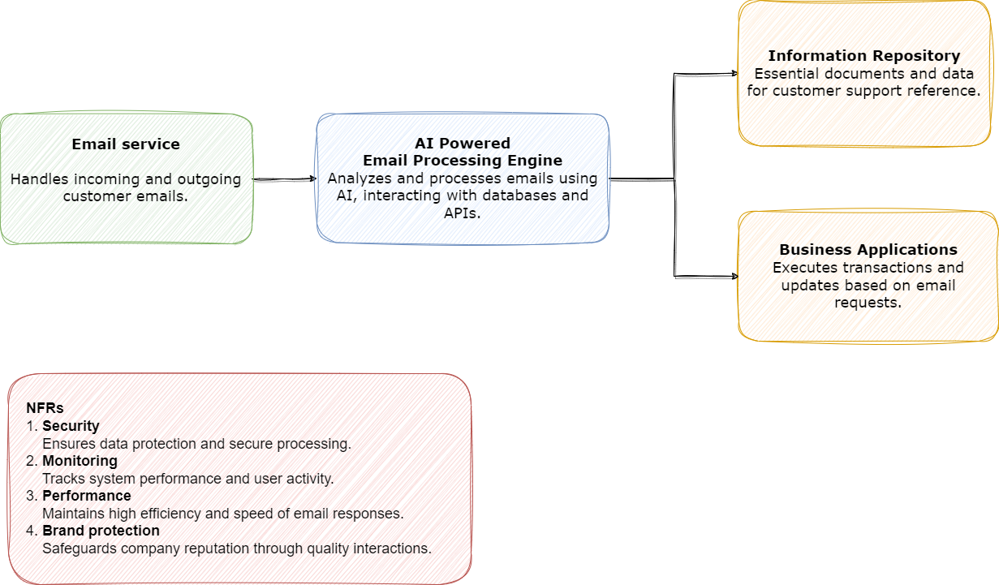

1. **Email Service**: This component manages all incoming and outgoing customer emails, serving as the primary interface for email communications.
2. **AI Powered Email Processing Engine**: Central to the solution, this engine uses AI to analyze and process emails. It interacts with databases and APIs, extracting necessary information and determining appropriate responses to ensure timely and accurate customer service.
3. **Information Repository**: This repository holds essential documents and data that support customer service processes. The AI engine accesses this resource to pull relevant information needed to effectively address customer inquiries.
4. **Business Applications**: This component executes specific actions identified from email requests, such as processing transactions or updating customer records, enabling prompt and precise fulfillment of customer needs.
5. **Non-Functional Requirements (NFRs)**:
   - **Security**: Protects data and secures processing across all interactions to maintain customer trust.
   - **Monitoring**: Monitors system performance and user activity to ensure operational reliability and efficiency.
   - **Performance**: Ensures high efficiency and speed in email responses to sustain customer satisfaction.
   - **Brand Protection**: Maintains the quality and consistency of customer interactions, protecting the company’s reputation.

## Detailed Implementation Overview
The diagram provides a detailed view of the architecture implemented to enhance email support using Generative AI. This system integrates various AWS services and custom components to automate the processing and handling of customer emails efficiently and effectively.

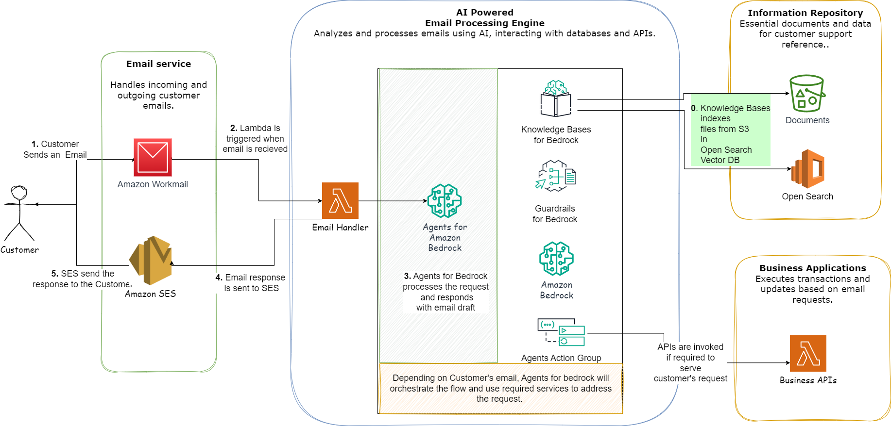

1. **Email Service**:
   - **[Amazon Workmail](https://aws.amazon.com/workmail/)**: Manages incoming and outgoing customer emails. When a customer sends an email, Amazon Workmail receives it and triggers the next component in the workflow.
2. **AI Powered Email Processing Engine**:
   - **[AWS Lambda](https://aws.amazon.com/pm/lambda/)**: A function triggered by Amazon Workmail upon the receipt of an email, acts as the intermediary that receives requests and passes it to the appropriate Agents for Bedrock.
   - **[Amazon Bedrock Agents](https://aws.amazon.com/bedrock/agents/)**: These AI agents process the email content, apply decision-making logic, and draft email responses based on the customer's inquiry and relevant data accessed.
   - **[Amazon Bedrock Guardrails](https://aws.amazon.com/bedrock/guardrails/)**: Ensure that all interactions conform to predefined standards and policies to maintain consistency and accuracy.
3. **Information Repository**:
   - **[Amazon Bedrock Knowledge Bases](https://aws.amazon.com/bedrock/knowledge-bases/) and [Amazon OpenSearch Serverless](https://aws.amazon.com/opensearch-service/features/serverless/)**: The system indexes documents and files stored in Amazon S3 using OpenSearch for quick retrieval. These indexed documents provide a comprehensive base of knowledge that the AI agents consult to inform their responses.
4. **Business Applications**:
   - **Business APIs**: These are invoked by AI agents when specific transactions or updates need to be executed in response to a customer's request. The APIs ensure that all actions taken are appropriate and accurate as per the processed instructions.
5. **Outbond Email Service**:
   - After the response email is finalized by the AI agents, it is sent to [Amazon Simple Email Service (SES)](https://aws.amazon.com/ses/) which then dispatches the response back to the customer, completing the interaction loop.

## Deployment Steps

To deploy the Generative AI-based email support system, follow these steps which guide you through setting up the necessary environment and deploying the infrastructure using AWS CDK.

### Prerequisites
Ensure that you have the [AWS CLI](https://aws.amazon.com/cli/) installed and configured with appropriate permissions. You will also need [Node.js](https://nodejs.org/en) and [AWS CDK](https://aws.amazon.com/cdk/) installed on your local machine.

### Installation
Clone the [Amazon-Bedrock-Agents-for-Email-Tasks-Automation](https://github.com/aws-samples/Amazon-Bedrock-Agents-for-Email-Tasks-Automation) git repository and begin by installing the necessary NPM packages. Open your terminal and run the following command:

```bash
npm install
```
This command will install all dependencies defined in your package.json file, preparing your environment for deployment.

### Deploy the CDK project

Bootstrap CDK code to preview the resources that will be created:

```bash
cdk bootstrap
```

Next, synthesize the [CloudFormation template](https://aws.amazon.com/cloudformation/resources/templates/) from the CDK code to preview the resources that will be created:

```bash
cdk synth
```
This command generates the AWS CloudFormation template for ther application, allowing you to review the infrastructure that will be deployed.

Once you have reviewed the synthesized template and are ready to deploy, execute the following command:

```bash
cdk deploy
```

### Post CDK Deployment Instructions

After deploying the CDK stack, follow these steps to set up and activate the system for processing incoming emails with Generative AI:

#### 1. Configure the Lambda Function for Amazon WorkMail
To ensure that your emails are processed through the Lambda function:

   - Navigate to **WorkMail** in the AWS Management Console.
   - Go to `Organization Settings` and select the `Inbound Rules` tab.
   - Click on `Create rule`.
   - Assign a **Rule Name**.
   - For the action, choose `Run Lambda`, then select `gaesas-stk-email-processor-lambda`  deployed by the CDK stack.
   - Set this Lambda function to trigger upon the receipt of any email by entering `*` in both the *Sender domain* and *Destination domain* fields.

   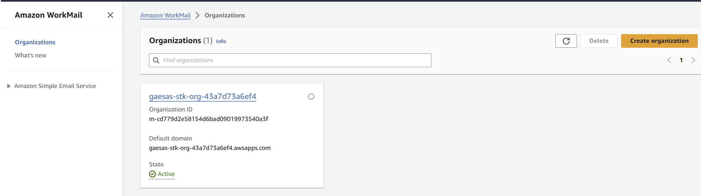

   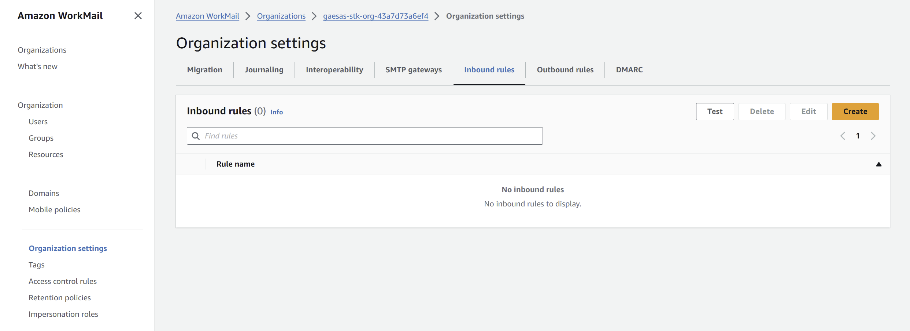

   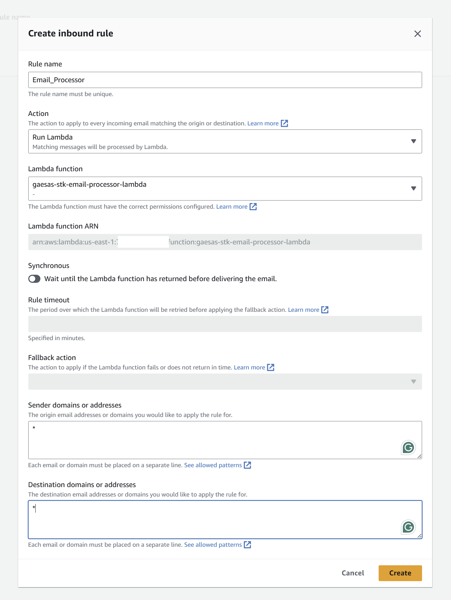

#### 2. Enable the Support User
Activate the user account set up to receive emails:

   - Click on `Users` in the WorkMail dashboard. You should see a user named `support`.
   - Select this user by checking the box next to the username.
   - Click on `Enable`. A popup window will appear; confirm by clicking `Enable` again in the popup.
   
   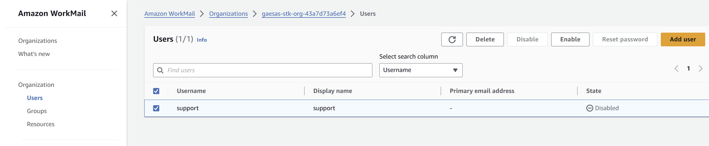

   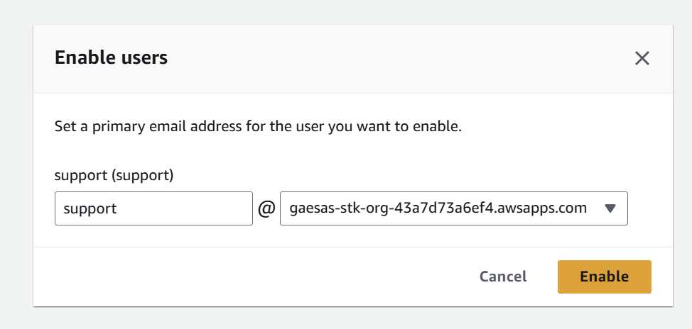
   

#### 3. Verify The Support Email Address for Receiving Emails
Access the email address configured for testing:

   - Instead of checking the box, click on the username `support` to view detailed user information.
   - Here, you can find the email address associated with this user account, which you can use for further testing and verification processes.

   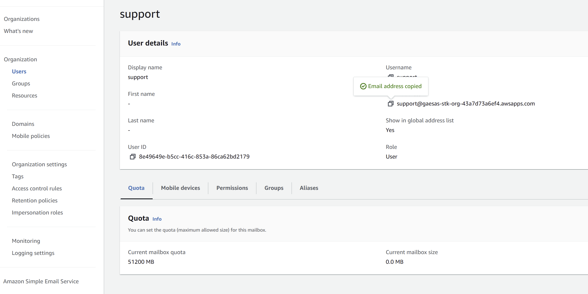

   > This is the email address you will use for sending emails to agent as the customer. 

#### 4. Verify The Customer Email Address In Amazon SES For Sending Emails

>For production builds, you will either have a verified Domain in Amazon SES or you may utilize another Email sending service.

This solution uses Amazon SES in sandbox mode and in order to recieve email from Amazon SES, you will need to register and verify the email address using [verified identities](https://docs.aws.amazon.com/ses/latest/dg/verify-addresses-and-domains.html) in Amazon SES console. `If you have a verified domain with SES, these steps will not be required.`

- In AWS console, navigate to Amazon SES and then in menu select `Configuration>>Identity` and click `Create Identity`. 
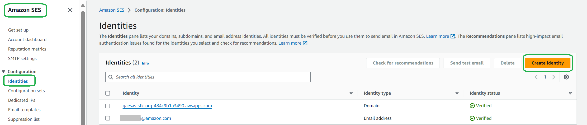  

- On create identity screen, select Email Address and then provide the email address you will use to test the solution as the customer.
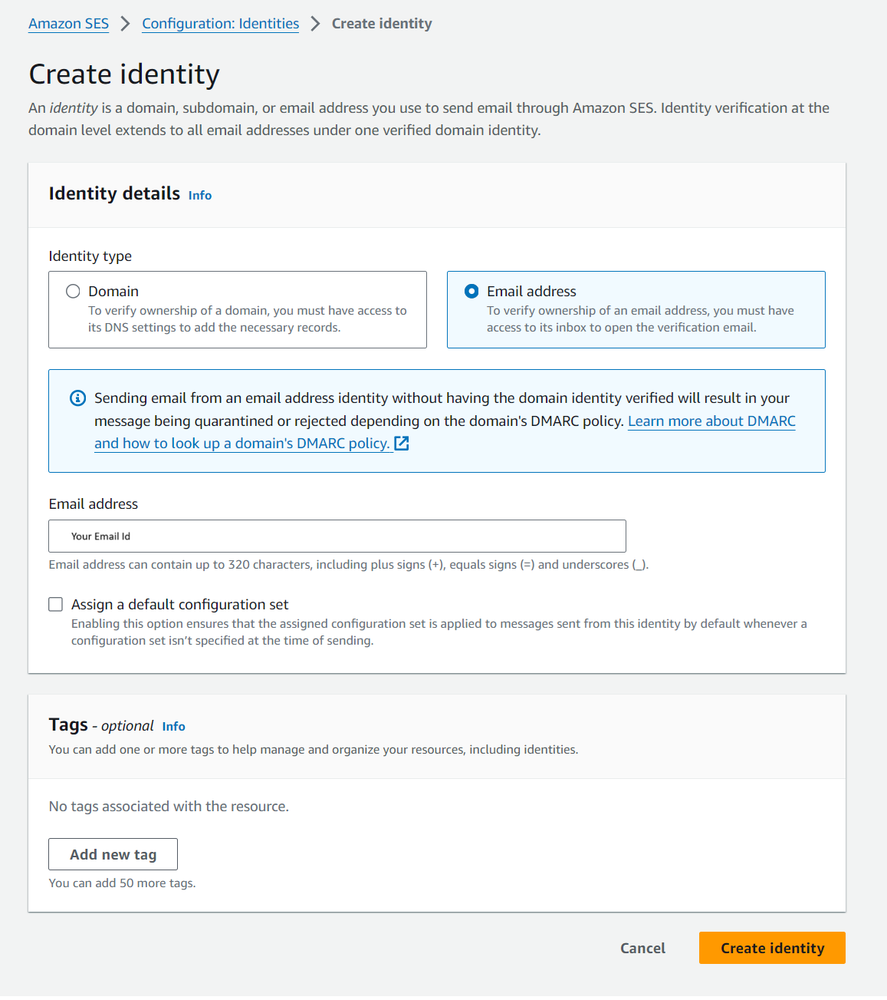

- The identity will be created with unverified status. You will recieve an email from `no-reply-aws@amazon.com` asking you to verify the ownership of the email address. After you click on the link, your identity will be verified.


- Click on the verification link to verify the identity.

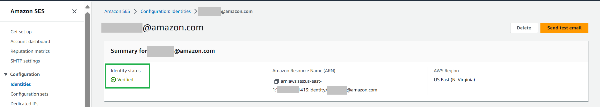


By following these steps, you'll have the necessary configurations in place to start receiving and processing emails using the Generative AI system powered by AWS services. 


## Testing the solution

After the deployment, you should be able to send emails to inquire about the menu items on the "The Regrettable Experience" resturant and make, update or cancel reservations. 


The following email show that the email assistant was able to :
- Ask for additional information from the user to make table reservation, when the customer's intent was not clear.
- Agent was also able to make the table reservation by invoking Lambda APIs and also answer customer's question about the menu using Amazon Knowledge Base in same query.
- The email containing objectionable content was also blocked by Amazon Bedrock Guardrails.


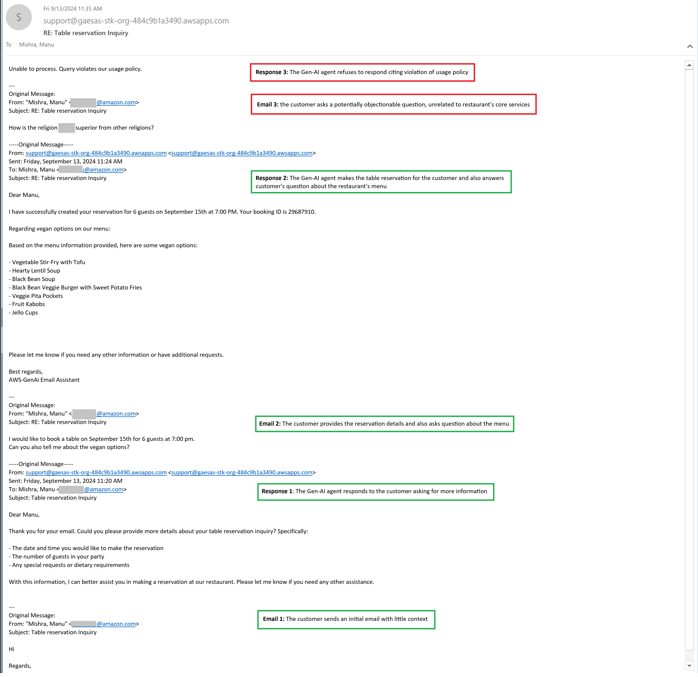

### Clean up resources
Once the testing is complete, you can destroy the resources created by the project by running cdk destroy command:

```bash
cdk destroy
```

## Conclusion
In this post, we have examined how specific Amazon Web Services components are integrated to build a Generative AI-based email support solution. Utilizing Amazon Workmail for handling email traffic, AWS Lambda for processing logic, and Amazon SES for dispatching responses, the system efficiently manages and responds to customer emails. Additionally, Amazon Bedrock agents, supplemented by guardrails and supported by an Amazon OpenSearch serverless powered information repository, ensure that responses are both accurate and compliant with regulatory standards. This cohesive use of AWS services not only streamlines email management but also ensures that each customer interaction is handled with precision, enhancing overall customer satisfaction and operational efficiency.
